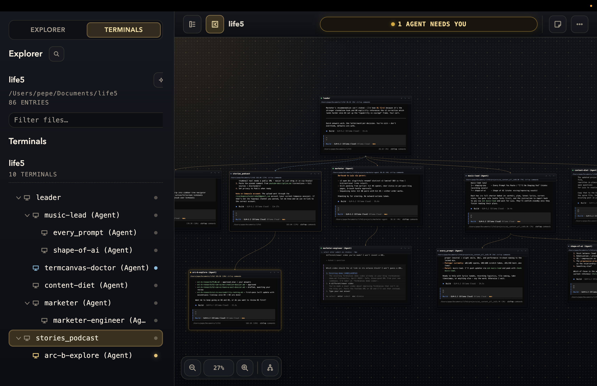

# termcanvas

## see your agent fleet in one sidebar.

termcanvas is an open-source macos app for steering claude code, codex, opencode, and shell sessions with a tmux-backed focused terminal and a live agent tree.

each node is a real terminal. the sidebar shows your live agent tree. the header shows the current canvas fleet summary, and the focused terminal is the one you are steering.

[download the latest release](https://github.com/lout33/termcanvas/releases/latest) | [read the story](https://yupanqui.xyz/termcanvas-demo) | [install the agent skill](https://skills.sh/lout33/termcanvas)

requires macos on apple silicon, [`tmux`](https://github.com/tmux/tmux), and python 3. the current build is unsigned.



## why it exists

running several coding agents is easy. keeping track of them is the work.

once every task has its own terminal, you start checking the same tabs on a loop: which agent is working, which one finished, which one needs input, and which one quietly failed.

termcanvas keeps the current branch visible. the sidebar keeps the agent tree nearby, and the header summarizes the current canvas. prompt detection is heuristic, so the app can still miss a request for input.

## install

1. install tmux:

   ```bash
   brew install tmux
   ```

2. make sure `python3 --version` works in your terminal.
3. download the `.dmg` from the [latest release](https://github.com/lout33/termcanvas/releases/latest).
4. move `TermCanvas.app` into `/Applications`.
5. right-click the app in Finder and choose `Open` the first time.

if gatekeeper still blocks the unsigned build, open `System Settings > Privacy & Security` and choose `Open Anyway`.

on first launch, choose a project folder. double-click empty canvas space to create your first terminal.

## what it does

- runs real interactive terminals with one focused terminal at a time
- shows working, idle, done, stale, failed, and waiting agents in one fleet summary
- shows agent spawn lineage in the sidebar tree
- lets any agent create a child, connect to a peer, or delegate with `ask` (peer links exist in the runtime; the sidebar shows spawn lineage, not drawn peer edges)
- keeps terminals alive through app relaunches with tmux
- restores canvases, positions, titles, project folders, and terminal identity
- browses and previews project files beside the terminals using them
- focuses one terminal across the workspace without losing the rest of the canvas
- exports and imports canvas or full app data as json

prompt detection is best-effort. agent harnesses render prompts differently, so some requests for input may not be recognized yet.

## who it is for

termcanvas is for developers already running several coding agents, shells, services, or logs and feeling the cost of checking them manually.

if you run one agent in one terminal, your existing terminal is probably enough.

## why not just use tmux or tabs?

tmux is the durable session layer underneath termcanvas. it keeps processes alive, but it does not show the current canvas agent tree or fleet state.

tabs and panes work while the workload still fits in your head. termcanvas becomes useful when the question changes from "where is that terminal?" to "which terminal needs me now?"

## the agent graph

termcanvas includes [`agentmux`](./vendor/agentmux), which lets managed terminals address each other at runtime. there is no fixed commander or manager. any agent can create a child, connect to another agent, and delegate work.

every terminal created on the canvas starts with `AGENTMUX_PROJECT`, `AGENTMUX_AGENT_NAME`, `AGENTMUX_BIN`, and related environment variables. agents launched inside it inherit that context automatically.

inside a managed terminal, agents can use:

```bash
"$AGENTMUX_BIN" neighbors
"$AGENTMUX_BIN" child <parent> <name> --harness <ai-harness> --prompt "handle this task"
"$AGENTMUX_BIN" connect <agent-a> <agent-b> --announce
"$AGENTMUX_BIN" ask <agent> "investigate this and return the answer"
"$AGENTMUX_BIN" check <agent>
"$AGENTMUX_BIN" logs <agent> --lines 120
"$AGENTMUX_BIN" send <agent> "follow up on x"
```

when `--harness` is omitted, `child` inherits an ai parent's harness. a shell parent with `--prompt` must choose an ai harness explicitly, so a natural-language task cannot become a shell command by accident. use `--harness shell` only for literal shell input, for example `--harness shell --prompt "git status"`.

`ask` waits for the target agent's turn to finish and returns its output, so agents can delegate and receive answers without using the ui as a message bus.

the sidebar shows spawn lineage. peer links remain runtime relationships, but the focused-terminal interface does not draw them as lines.

## install the agent skill

termcanvas works without a skill. installing the bundled `agentmux` skill teaches claude code, codex, opencode, cursor, and other compatible agents how to inspect and operate the graph themselves.

the app offers to install it on first launch. you can also install the public copy:

```bash
npx skills add lout33/termcanvas --skill agentmux -g -a codex -a claude-code -a opencode
```

the skill teaches agents how to use the runtime; it does not install termcanvas or agentmux separately. packaged builds already include the agentmux runtime.

## session behavior

termcanvas saves layout and terminal identity automatically.

- closing the app detaches from tmux-backed terminals and preserves them for relaunch
- reopening the app reattaches to the same tmux sessions
- closing a terminal node with `x` destroys that terminal session
- killing a tmux session outside termcanvas ends continuity for that terminal
- without tmux, termcanvas restores the layout but not the live shell process

tmux sessions survive closing termcanvas. they do not survive a machine reboot unless tmux is restored separately.

## controls

- double-click empty space to create a terminal
- drag empty space to pan
- use a modified mouse wheel to zoom
- drag a terminal by its header to move it
- `Cmd+B` toggles the sidebar
- `Cmd+M` focuses or restores the selected terminal
- `Cmd+L` closes the file preview
- `Esc` closes the current preview or exits focused mode

## macos permissions

commands inside termcanvas may ask for access to protected files or apps because macos attributes terminal-command permissions to the app hosting the terminal.

for unrestricted developer workflows, install termcanvas in `/Applications`, then open `TermCanvas > Open Full Disk Access Settings...` and enable it. macos may still request separate approval for camera, automation, apple music, or other services when a command first uses them.

only approve access when you intended the terminal command to use that resource. termcanvas cannot grant these permissions automatically.

## run from source

```bash
git clone https://github.com/lout33/termcanvas.git
cd termcanvas
npm install
npm run dev
```

build and test:

```bash
npm run build
npm test
```

create local unsigned macos artifacts:

```bash
npm run dist:mac
```

## github releases

github releases are created by the release workflow when a `v*` tag matching `package.json` is pushed. prepare and verify the version locally before creating the tag:

```bash
npm version patch --no-git-tag-version
npm test
npm run dist:mac
VERSION="$(node -p "require('./package.json').version")"
git tag "v$VERSION"
git push origin "v$VERSION"
```

the tag push creates the github release and uploads only the versioned dmg and zip artifacts. pushing a tag is the public release action; local packaging alone does not publish anything.

## current limits

- macos on apple silicon only
- unsigned builds
- requires python 3 (the agentmux wrapper calls external `python3`)
- prompt and status detection is heuristic
- focused-terminal mode: one terminal shown at a time, not multiple simultaneously
- worker placement is manual
- no collaboration or shared multi-window workflow
- early, solo-maintained software

if termcanvas gets a status wrong or still makes you hunt through tabs, [open an issue](https://github.com/lout33/termcanvas/issues) with the agent harness and prompt that caused it.

## stack

electron, `node-pty`, tmux, `xterm.js`, and the bundled agentmux runtime. node and shell access stay in electron's main process rather than the renderer.

## development

read [`AGENTS.md`](./AGENTS.md) before changing the codebase. it documents the terminal lifecycle, persistence model, ipc boundaries, and verification expectations.

## license

[mit](./LICENSE)
